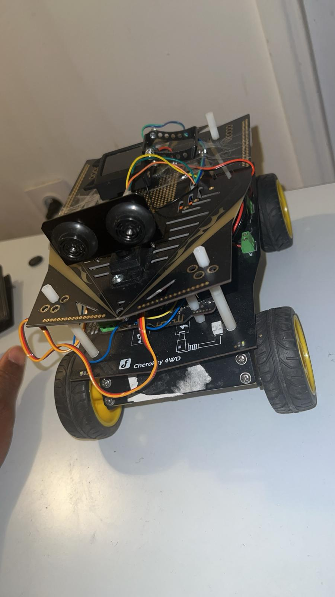

# 🤖 Navigation Autonome - Robot Cherokey 4WD

Ce dépôt rassemble les différents algorithmes de navigation et de traitement d'image développés pour le robot **Cherokey 4WD** (DFRobot) basé sur une architecture Arduino (ATmega328P / ATmega2560).

L'objectif de ce projet est de doter le robot de capacités d'adaptation face à son environnement à travers trois modes de fonctionnement distincts.

---
## 🛠️ Matériel Utilisé

Ce projet s'appuie sur le châssis **Cherokey 4WD** de DFRobot, enrichi d'une vision IA et d'un capteur de distance haute précision.

<details>
<summary><b>🔴 1. Plateforme Mobile : Cherokey 4WD</b></summary>
<br>



* **Rôle :** Cœur de mobilité du robot, assurant le déplacement dans l'environnement.
* **Détails techniques :** * Châssis à 4 roues motrices (4WD) permettant une excellente adhérence sur sol dur (parquet/carrelage).
    * Pont en H (L298N) intégré à la carte d'extension, permettant de gérer la puissance et le sens de rotation des moteurs CC indépendamment.
    * Conception en acrylique offrant un support robuste et modulaire pour l'Arduino et les batteries.
</details>

<details>
<summary><b>🔴 2. Cerveau IA : HuskyLens</b></summary>
<br>


* **Rôle :** Système de traitement d'image et de perception intelligente par IA.
* **Détails techniques :**
    * Caméra capable de reconnaissance de formes, de visages et de couleurs en temps réel.
    * Communication I2C avec l'Arduino, ce qui permet une lecture rapide des coordonnées des objets (X, Y).
    * Algorithmes embarqués : utilisations principales pour le suivi de ligne (`line-follower.ino`) et le pistage d'objets colorés (`color-tracker.ino`).
</details>

<details>
<summary><b>🔴 3. Capteur de Distance : URM37 Ultrasons</b></summary>
<br>


* **Rôle :** Radar de proximité pour la détection d'obstacles et la cartographie du labyrinthe.
* **Détails techniques :**
    * Utilisation du protocole PWM pour une lecture précise de la distance.
    * Calcul basé sur le temps de trajet des ondes sonores (aller-retour).
</details>

<details>
<summary><b>🔴 4. Actuateur : Micro Servo 9g</b></summary>
<br>


* **Rôle :** Mécanisme de scan actif permettant d'élargir le champ de vision du capteur ultrason.
* **Détails techniques :**
    * Positionnement angulaire piloté par signal PWM.
    * Balayage automatique cyclique de 60° à 120°.
    * Utilité : permet de transformer une mesure frontale unique en une lecture panoramique pour mieux détecter les coins et murs du labyrinthe.
</details>

---

## 🗂️ Architecture des Codes

Le projet est divisé en 3 scripts indépendants, optimisés pour éviter le gel du processeur grâce à l'utilisation de tâches cadencées (`Metro.h`) plutôt que des fonctions bloquantes (`delay`).

### 1. 🌀 Résolution de Labyrinthe (`/01-labyrinthe`)
* **Principe :** Navigation autonome par évitement d'obstacles pour sortir d'un labyrinthe.
* **Logique :** * Un servo fait osciller le capteur ultrason entre 60° et 120° pour scanner l'horizon en continu.
  * L'exécution utilise une **machine à états finis** stricte (`DRIVE_FORWARD` ➔ `EVADE_BACK` ➔ `EVADE_TURN`).
  * En cas d'obstacle ($\le 25$ cm), le robot analyse la position du servo pour en déduire la direction du mur, s'arrête, effectue un recul franc, puis pivote du côté libre.
    
## Pour en savoir plus sur le cablage du servo moteur et du capteur ultrason utilisé:https://wiki.dfrobot.com/rob0117/docs/21533 .


### 🎯 2. Suivi de Ligne Automatique (`/02-suivi_de_ligne`)
* **Principe :** Suivi de trajectoire au sol (ruban noir sur fond blanc par exemple!).
* **Logique :**
  * Utilisation des capteurs infrarouges / HuskyLens dédiés au suivi de ligne.
  * Gestion fine de la vitesse différentielle des moteurs droit et gauche du Cherokey 4WD pour négocier les virages serrés sans déraper.
    
 ## Pour bien configuré la fonction "line tracking " du Huskylens:https://wiki.dfrobot.com/sen0305/docs/22638

### 🛣️ 3. Suivi de Cible par Couleur (`/03-suivi_de_couleur`)
* **Principe :** Suivi visuel en temps réel d'un objet ou d'une couleur spécifique.
* **Logique :**
  * Utilisation de l'algorithme de reconnaissance de couleur (`COLOR_RECOGNITION`) de la caméra HuskyLens.
  * Récupération instantanée du centre X du bloc détecté. Si l'objet sort du champ de vision, le robot déclenche un frein électronique d'urgence (`LOST`).
  * Si l'objet bouge, le robot ajuste sa trajectoire via une zone morte (`DEAD_ZONE`) centrale pour le suivre de manière fluide.

## Apprendre un peu plus sur la fonction "COLOR_RECOGNITION" :https://wiki.dfrobot.com/sen0305/docs/22646

---

## 💻 Installation et Déploiement

1. Clonez ce dépôt sur votre machine :
   ```bash
   git clone https://github.com/Bill1952-olt/cherokey_navigation.git
2. vous pouvez ensuite installer les bibliothèques manquant ,puis utiliser les liens plus haut pour assembler et configurer le cherokey .


## 🔌 Câblage et Paramétrage

Voici la documentation technique pour la configuration matérielle et les constantes de pilotage.

### 1. Configuration des Pins (Arduino)
| Pin Arduino | Composant | Fonction |
| :--- | :--- | :--- |
| **3** | URM37 | Signal PWM |
| **4** | Moteur M1 | Direction |
| **5** | Moteur M1 | Vitesse (PWM) |
| **6** | Moteur M2 | Vitesse (PWM) |
| **7** | Moteur M2 | Direction |
| **9** | Servo | Signal Servo |
| **10** | URM37 | Trigger |
| **A4 (SDA)** | HuskyLens | Données I2C |
| **A5 (SCL)** | HuskyLens | Horloge I2C |

### 2. Paramètres de Navigation (Labyrinthe)
| Paramètre | Valeur | Rôle |
| :--- | :--- | :--- |
| `OBSTACLE_DIST` | 15-30 cm | Seuil de détection du mur |
| `BACK_DURATION` | 150-400 ms | Temps de recul d'urgence |
| `TURN_DURATION` | 300-550 ms | Temps de pivot pour virage |

### 3. Paramètres de Vision (Suivi de ligne)
| Paramètre | Valeur | Rôle |
| :--- | :--- | :--- |
| `DEAD_ZONE` | 60-95 px | Tolérance du centrage cible |
| `SCAN_TURN_DURATION` | 350 ms | Durée du scan de recherche |
| `LOST_CONFIRM` | 4 frames | Seuil de perte de cible |


