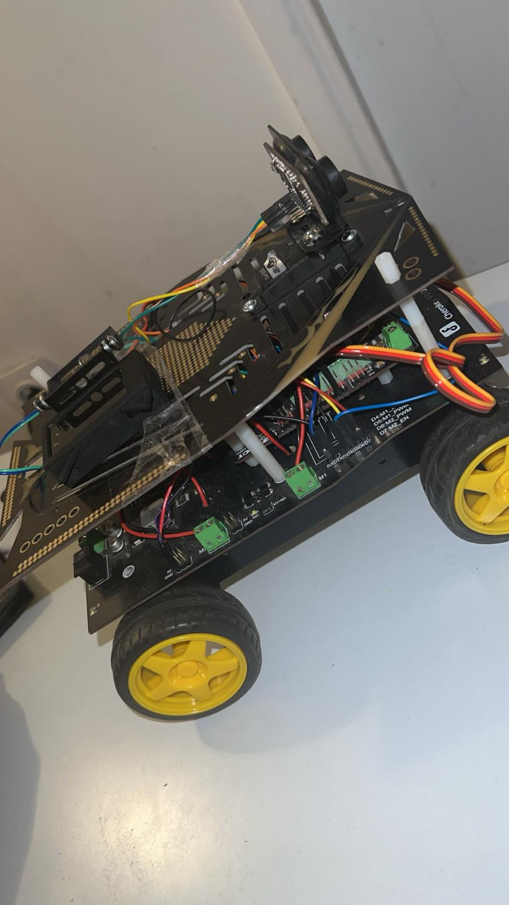
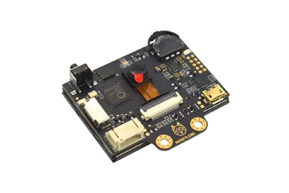
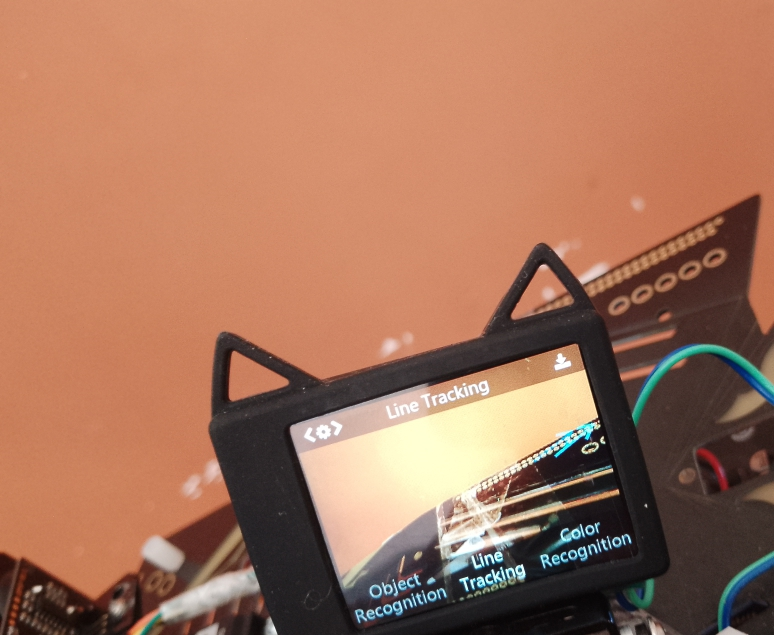
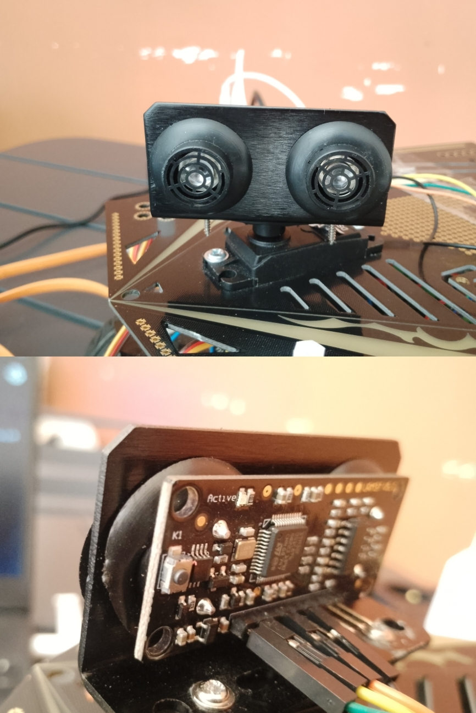

# 🤖 Navigation Autonome - Robot Cherokey 4WD

Ce dépôt rassemble les différents algorithmes de navigation et de traitement d'image développés pour le robot **Cherokey 4WD** (DFRobot) basé sur une architecture Arduino (ATmega328P / ATmega2560).

L'objectif de ce projet est de doter le robot de capacités d'adaptation face à son environnement à travers trois modes de fonctionnement distincts.

---

## 🛠️ Matériel Utilisé

Ce projet s'appuie sur le châssis Cherokey 4WD de DFRobot, agrémenté d'une caméra IA et d'un capteur de distance pour la navigation autonome.

#### 1. Plateforme Mobile : Cherokey 4WD



* **Description :** Le Cherokey 4WD est le cœur mobile du projet. Il s'agit d'un châssis robotique à quatre roues motrices robuste, fabriqué par DFRobot. Il intègre directement un pont en H L298N sur sa carte d'extension, ce qui simplifie grandement le contrôle de puissance des moteurs CC. Sa plateforme supérieure en acrylique offre suffisamment d'espace pour accueillir l'Arduino, la batterie et tous nos capteurs.

#### 2. Cerveau IA : HuskyLens


* **Description :** La HuskyLens est une caméra de vision par intelligence artificielle facile à utiliser. Dans notre projet, elle est connectée en I2C à l'Arduino. Elle est capable d'apprendre et de reconnaître des visages, des objets ou, dans notre cas précis, des couleurs pour le suivi (`color-tracker.ino`) ou des lignes au sol (`line-follower.ino`) grâce à ses algorithmes embarqués.

#### 3. Capteur de Distance : URM37 Ultrasons


* **Description :** Ce capteur de distance est essentiel pour le mode labyrinthe (`maze_solver.ino`). Il fonctionne en mode PWM. Il émet des salves d'ultrasons et mesure le temps que met l'écho à revenir, permettant de calculer précisément la distance face à un obstacle.

#### 4. Actuateur : Micro Servo 9g


* **Description :** Ce petit moteur sert de mécanisme de balayage pour le capteur ultrason URM37. Il fait osciller le capteur de gauche à droite sur un arc de 60° (entre 60° et 120°) pour permettre au robot de "scanner" l'horizon et de détecter les murs sur ses flancs, plutôt que de regarder uniquement droit devant lui.

---

---

## 🗂️ Architecture des Codes

Le projet est divisé en 3 scripts indépendants, optimisés pour éviter le gel du processeur grâce à l'utilisation de tâches cadencées (`Metro.h`) plutôt que des fonctions bloquantes (`delay`).

### 1. 🌀 Résolution de Labyrinthe (`/01-labyrinthe`)
* **Principe :** Navigation autonome par évitement d'obstacles pour sortir d'un labyrinthe.
* **Logique :** * Un servo fait osciller le capteur ultrason entre 60° et 120° pour scanner l'horizon en continu.
  * L'exécution utilise une **machine à états finis** stricte (`DRIVE_FORWARD` ➔ `EVADE_BACK` ➔ `EVADE_TURN`).
  * En cas d'obstacle ($\le 25$ cm), le robot analyse la position du servo pour en déduire la direction du mur, s'arrête, effectue un recul franc, puis pivote du côté libre.
    
## Pour en savoir plus sur le cablage du servo moteur et du capteur ultrason utilisé:https://wiki.dfrobot.com/rob0117/docs/21533 .


### 🎯 2. Suivi de Ligne Automatique (`/02-suivi_de_ligne`)
* **Principe :** Suivi de trajectoire au sol (ruban noir sur fond blanc par exemple!).
* **Logique :**
  * Utilisation des capteurs infrarouges / HuskyLens dédiés au suivi de ligne.
  * Gestion fine de la vitesse différentielle des moteurs droit et gauche du Cherokey 4WD pour négocier les virages serrés sans déraper.
    
 ## Pour bien configuré la fonction "line tracking " du Huskylens:https://wiki.dfrobot.com/sen0305/docs/22638

### 🛣️ 3. Suivi de Cible par Couleur (`/03-suivi_de_couleur`)
* **Principe :** Suivi visuel en temps réel d'un objet ou d'une couleur spécifique.
* **Logique :**
  * Utilisation de l'algorithme de reconnaissance de couleur (`COLOR_RECOGNITION`) de la caméra HuskyLens.
  * Récupération instantanée du centre X du bloc détecté. Si l'objet sort du champ de vision, le robot déclenche un frein électronique d'urgence (`LOST`).
  * Si l'objet bouge, le robot ajuste sa trajectoire via une zone morte (`DEAD_ZONE`) centrale pour le suivre de manière fluide.

## Apprendre un peu plus sur la fonction "COLOR_RECOGNITION" :https://wiki.dfrobot.com/sen0305/docs/22646

---

## 💻 Installation et Déploiement

1. Clonez ce dépôt sur votre machine :
   ```bash
   git clone [https://github.com/VOTRE_PSEUDO/robot-cherokey-navigation.git](https://github.com/VOTRE_PSEUDO/robot-cherokey-navigation.git)


